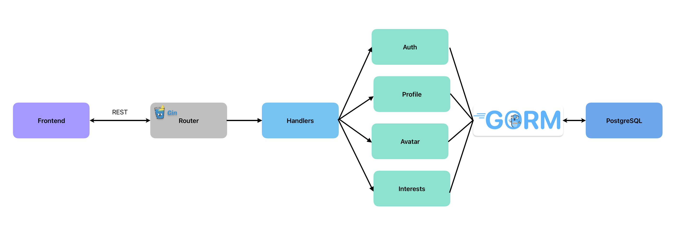
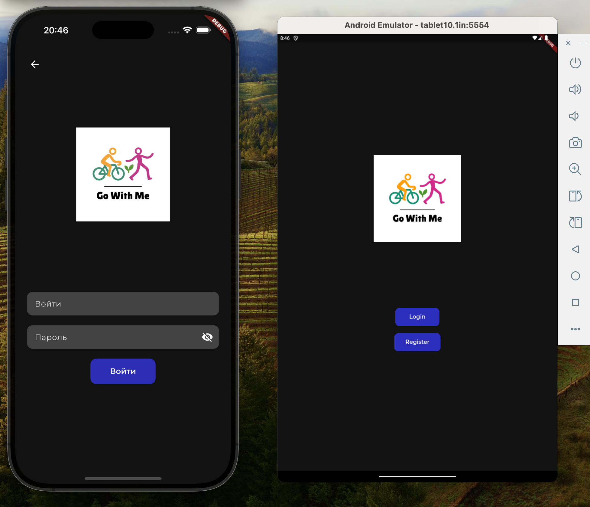
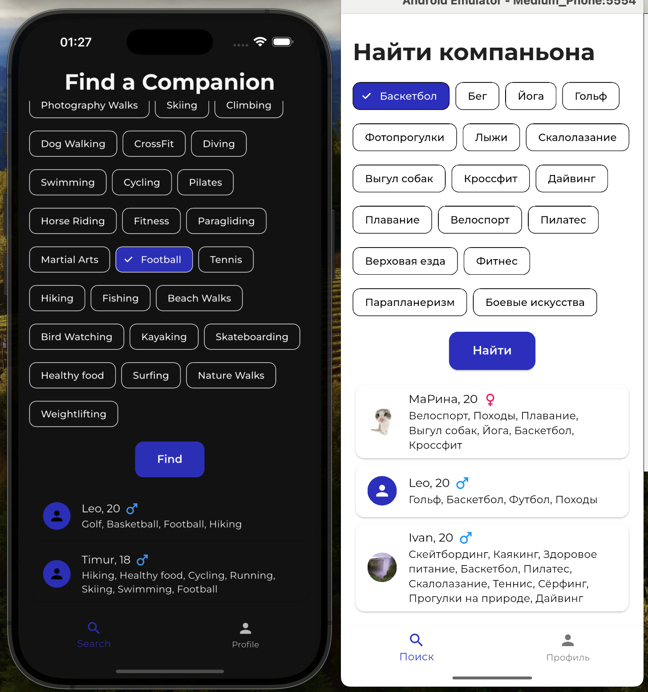
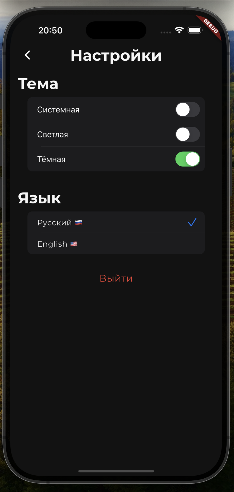

# GoWithMe – Find Your Activity Buddy

**GoWithMe** is a full-stack cross-platform app that helps people find partners for sports and healthy lifestyle activities in their local area. The project was built during the **Flutter Summer Course** at Innopolis University

---

## Team

| Name              | Role(s)                        | Responsibilities                                  |
|-------------------|-------------------------------|---------------------------------------------------|
| Lavrova Marina    | Frontend, Task Planning        | Flutter, UI, integration with backend, task board |
| Alexander Blinov  | Backend, DB            | Architecture, database, backend, API, design slides     |
| Leonid Merkulov   | DevOps, Tests, Docs, Slides    | CI/CD, Docker, tests, documentation, presentation |

---

## Implementation checklist


### Technical requirements (20 points)
#### Backend development (8 points)
- [3] Go-based backend (3 points)
- [2] RESTful API with Swagger documentation (2 point)  [- api](https://github.com/MAL-da-udal/GoWithMe/blob/dev/backend/internal/api/handlers.go) and [docs](https://github.com/MAL-da-udal/GoWithMe/tree/dev/backend/docs) 
- [1] PostgreSQL database with proper schema design (1 point) [- db](https://github.com/MAL-da-udal/GoWithMe/tree/dev/backend/internal/db)
- [1] JWT-based authentication and authorization (1 point) [- jwt](https://github.com/MAL-da-udal/GoWithMe/blob/dev/backend/internal/api/handlers.go)
- [1] Comprehensive unit and integration tests (1 point) [- tests][https://github.com/MAL-da-udal/GoWithMe/blob/dev/backend/internal/api/api_test.go]

#### Frontend development (8 points)
- [3] Flutter-based cross-platform application (mobile + web) (3 points)  
all app
- [1] Responsive UI design with custom widgets (1 point) [- custom widgets](https://github.com/MAL-da-udal/GoWithMe/commit/bd9105f3eb86d3b883eb2aca849dcc2a5669ba45)
- [1] State management implementation (1 point) [- for search](https://github.com/MAL-da-udal/GoWithMe/commit/d6aabbab14efb84f276356a08fad985a69c3d67b) and [for theme](https://github.com/MAL-da-udal/GoWithMe/commit/bd9105f3eb86d3b883eb2aca849dcc2a5669ba45)
- [1] Offline data persistence (1 point) [- sharedPrefs](https://github.com/MAL-da-udal/GoWithMe/commit/1b49dfaa21b93b809e655cc596a6d0c9d690a846) and [getStorage](https://github.com/MAL-da-udal/GoWithMe/commit/c017b6bc00eae3f0e5c6b9612a5ad7d8465defa9)
- [1] Unit and widget tests (1 point) [- here](https://github.com/MAL-da-udal/GoWithMe/commits/dev/frontend/test)
- [1] Support light and dark mode (1 point) [- here](https://github.com/MAL-da-udal/GoWithMe/commit/bd9105f3eb86d3b883eb2aca849dcc2a5669ba45)

#### DevOps & deployment (4 points)
- [1] Docker compose for all services (1 point) [- here](https://github.com/MAL-da-udal/GoWithMe/blob/dev/compose.yaml)
- [1] CI/CD pipeline implementation (1 point) [- here](https://github.com/MAL-da-udal/GoWithMe/tree/dev/.github/workflows)
- [0] Environment configuration management using config files (1 point)
- [1] GitHub pages for the project (1 point) [- gh-pages](https://mal-da-udal.github.io/GoWithMe/)

### Non-Technical Requirements (10 points)
#### Project management (4 points)
- [1] GitHub organization with well-maintained repository (1 point)
- [1] Regular commits and meaningful pull requests from all team members (1 point)
- [1] Project board (GitHub Projects) with task tracking (1 point) [- board](https://github.com/orgs/MAL-da-udal/projects/5)
- [1] Team member roles and responsibilities documentation (1 point)

#### Documentation (4 points)
- [1] Project overview and setup instructions (1 point)
- [1] Screenshots and GIFs of key features (1 point)
- [1] API documentation (1 point)
- [1] Architecture diagrams and explanations (1 point)

#### Code quality (2 points)
- [1] Consistent code style and formatting during CI/CD pipeline (1 point)
- [1] Code review participation and resolution (1 point)

### Bonus Features (up to 10 points)
- [2] Localization for Russian (RU) and English (ENG) languages (2 points) [- here](https://github.com/MAL-da-udal/GoWithMe/commit/f6368d41d444b8317f04883e8c9038b5c97de1c9)
- [3] Good UI/UX design (up to 3 points) [- PR with design](https://github.com/MAL-da-udal/GoWithMe/pull/25)
- [0] Integration with external APIs (fitness trackers, health devices) (up to 5 points)
- [2] Comprehensive error handling and user feedback (up to 2 points) [- here](https://github.com/MAL-da-udal/GoWithMe/commit/c9de86cc1e6900de5b2f29abd3961aef8c840026)
- [3] Advanced animations and transitions (up to 3 points) [- custom transitions via go_router](https://github.com/MAL-da-udal/GoWithMe/pull/25/commits/bd9105f3eb86d3b883eb2aca849dcc2a5669ba45)
- [2] Widget implementation for native mobile elements (up to 2 points) [- settings page](https://github.com/MAL-da-udal/GoWithMe/blob/dev/frontend/lib/ui/pages/settings_page.dart)

Total points implemented: 29/30 (excluding bonus points)

---

## Project Overview

GoWithMe is designed to help users find activity partners for sports and healthy lifestyle events. The app supports user registration, profile management, activity search, and real-time results.

---

## Setup Instructions

### Prerequisites
- **Docker** & **Docker Compose** (recommended for all platforms)
- (For development only) Flutter (3.22+) and Go (1.22+)

---

### Quick Start (recommended)

The easiest way to run the project (backend, frontend, and database) is using Docker Compose:

```sh
# Clone the repository
git clone https://github.com/MAL-da-udal/GoWithMe.git
cd GoWithMe

# Build and start all services
docker compose up --build
```

- **Backend:** http://localhost:8080  
- **Frontend (Web):** http://localhost:80  
- **Swagger API docs:** http://localhost:8080/swagger/index.html

---

### Development Mode (for development)

If you want to run and update services separately:

#### Frontend

```sh
cd frontend
flutter pub get
flutter run 
```
Then choose the device on which you want to run

> Important note: now the frontend connected to the API of the deployed server , so if you want to use your local mashine as a server: - change the baseUrl ( uncomment the line 7 and comment the line 6 in the file `frontend/lib/data/api/api_client.dart`)


#### Backend

```sh
cd backend
go mod tidy
go run cmd/main.go
```

#### Database

- You can use the database from Docker Compose or your own local PostgreSQL instance.

---

### Running Tests

#### Frontend

```sh
cd frontend
flutter test --coverage
```

#### Backend

```sh
cd backend
go test ./...
```


---

## API Documentation

All documentation can be found in swagger. You can access it on `http://mhdserver.ru:8080/swagger/index.html`


---

## Architecture

### Backend


#### Stack Overview

* **HTTP Server framework:** gin
* **Database ORM:** gorm
* **Database:** PostgreSQL

### Key features
- JWT Authentication and authorization
- gORM for convenient communication with Database
- Gin framework to organize RESTful API
- Swagger for documentation

### Frontend Architecture

#### Stack Overview

* **State Management:** Flutter_riverpod
* **HTTP Client:** Dio handle errors and refresh auth token automatically
* **Storage:** GetStorage for auth/refresh tokens and shared_prefs for other data
* **Routing**: GoRouter with custom tranistions
* **Cross-platform**: supports all platform with specific settings customization 
* **Localization**: easyLocalization

### Key features

- Authorization - login/register, handling tokens
    - Automatically update access token after it expired using refresh token and interceptors in Dio
    - Handle errors
    - Store tokens in getStorage 
- Profile - create and update profile, offline storing
    - Store in cache with shared_prefs
    - Upadte via dio
- Search - apply filters, store state in riverpod
    - Load interests list from api
    - Load users matched the filters
    - Allow to open user profile with info and redirect to telegram
- Settings - theme and language switch + logout
    - Theme switching via Theme and riverpod
    - Translates all texts to chosen language 
    - Allows to logout 


---

### Architecture Diagram
### Frontend schema
```
[User]
  ↓
[UI Layer: Screens & Widgets]
  ├── auth_page.dart
  ├── home_page.dart
  ├── profile_tab.dart
  ├── search_tab.dart
  ├── settings_page.dart
  └── user_profile_page.dart
  ↓
[State Management (Riverpod Providers)]
  ├── searchProvider
  └── themeProvider
  ↓
[Repositories]
  ├── AuthRepository
  ├── ProfileRepository
  └── SearchRepository
  ↓
[API Client Layer]
  └── ApiClient (Dio + interceptors + token refresh logic)
      ├── Base URL: http://mhdserver.ru:8080
      ├── Request Interceptor (adds Authorization header)
      ├── Error Interceptor (handles 401 + refreshes token)
      └── Token Storage: GetStorage
  ↓
[HTTP REST API (Go Backend + PostgreSQL)]
```
### Layers, which is also included
```
[Models]
  ├── user.dart
  └── (interests, etc.)

[Utilities & Helpers]
  ├── validations.dart
  ├── show_api_error.dart
  ├── open_url.dart
  └── text_to_string.dart

[Local Storage Services]
  └── shared_preferences_service.dart

[Theming & Localization]
  ├── app_theme.dart
  ├── app_colors.dart
  ├── app_text_styles.dart
  └── assets/translations/ (en.json, ru.json)
  ```

Full app structure
```
[User]
   |
   v
[Flutter App]
   |
   v
[ApiClient] --> [AuthRepository, ProfileRepository, SearchRepository]
   |
   v
[REST API on Go] (Swagger)
   |
   v
[Business Logic Layer (Go)]
   |
   v
[PostgreSQL Database]
```

## Screenshots & GIFs

Full demo you could see [here](https://drive.google.com/drive/folders/16_uYnuXlzk4iJTm0Z0DVk7sfJwKf0gUK?usp=sharing)

### Login screen


### Profile screen


### Search

### Settings


---

## Links

- **GitHub Organization:** [MAL-da-udal](https://github.com/MAL-da-udal)
- **Repository:** [GoWithMe](https://github.com/MAL-da-udal/GoWithMe)
- **GitHub Pages (Web Demo):** https://mal-da-udal.github.io/GoWithMe/
- **Presentation video:** https://drive.google.com/drive/folders/16_uYnuXlzk4iJTm0Z0DVk7sfJwKf0gUK?usp=sharing
- **Project board:** https://github.com/orgs/MAL-da-udal/projects/5
